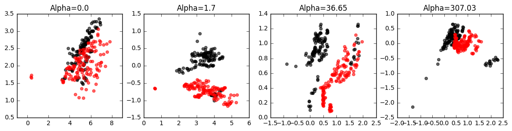
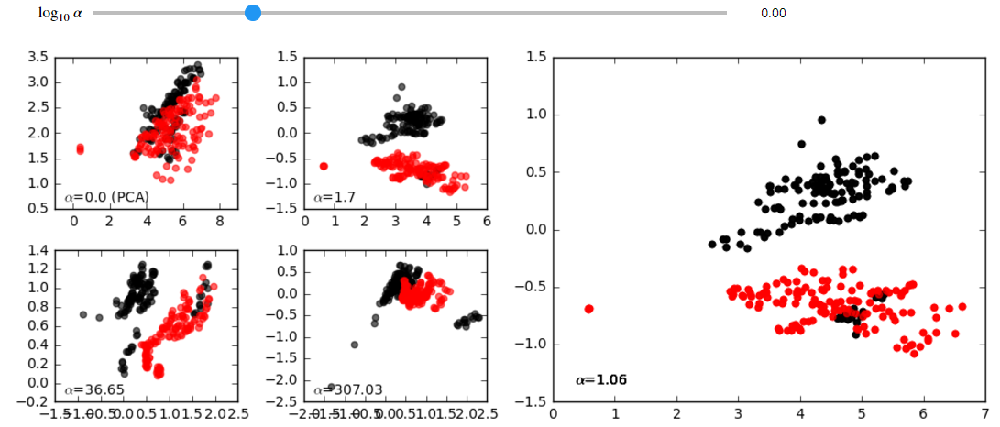
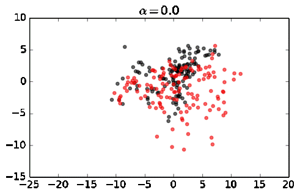
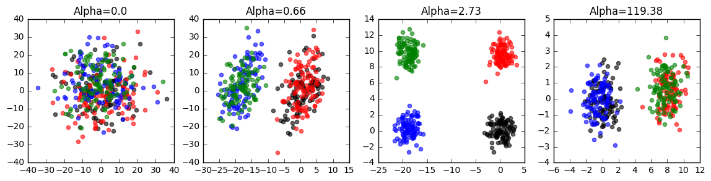
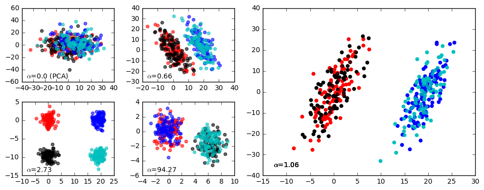

contrastive
===================
A python library for performing unsupervised machine learning on datasets with learning (e.g. PCA) in contrastive settings, where one is interested in patterns (e.g. clusters or clines) that exist one dataset, but not the other.

Applications include dicovering subgroups in biological and medical data. Here are basic installation and usage instructions, written for Python 3 (in which the library has been developed and tested, although it should work in Python 2 as well).

For more details, see the accompanying paper: `"Exploring Patterns Enriched in a Dataset with Contrastive Principal Component Analysis"
<https://www.nature.com/articles/s41467-018-04608-8.pdf/>`_, *Nature Communications* (2018), and please use the citation below.

.. code-block:: 

	@article{abid2018exploring,
	  title={Exploring patterns enriched in a dataset with contrastive principal component analysis},
	  author={Abid, Abubakar and Zhang, Martin J and Bagaria, Vivek K and Zou, James},
	  journal={Nature communications},
	  volume={9},
	  number={1},
	  pages={2134},
	  year={2018},
	}

This repository also includes experiments to reproduce most of the figures in the paper. Please see the python notebooks in the :code:`experiments` folder.

Installation
--------------------

.. code-block:: 

	$ pip3 install contrastive

Basic Usage
-------------------------------

The basic functions enabled by this library are shown below. Generally speaking, we have two datasets, one is a dataset that we can label as  :code:`foreground_data`, which is the dataset in which we are discovering patterns and directions, and another dataset called :code:`background_data`, which is the dataset that does not have the patterns or directions we are interested in discovering. In some cases, both datasets may contain the signal of interest, but the foreground dataset may have the pattern enriched relative to the background. In these analyses, there is a contrast parameter, known as alpha, which can be thought of as a hyperparameter.

.. code-block:: python

	from contrastive import CPCA

	mdl = CPCA()
	projected_data = mdl.fit_transform(foreground_data, background_data)
	
	#returns a set of 2-dimensional projections of the foreground data stored in the list 'projected_data', for several different values of 'alpha' that are automatically chosen (by default, 4 values of alpha are chosen)

Note that :code:`foreground_data` and :code:`background_data` should be 2D numpy arrays that have the second dimension (which represents the number of features). In other words, :code:`foreground_data.shape[1]==background_data.shape[1]` should return :code:`True`.

**Built-in plotting**: to quickly see the results of contrastive PCA, simply enable the :code:`plot` parameter to true:

.. code-block:: python

	from contrastive import CPCA

	mdl = CPCA()
	projected_data = mdl.fit_transform(foreground_data, background_data, plot=True)
	

**Interactive GUI**: if you are running these analyses inside a jupyter notebook, you can easily launch an interactive GUI as shown here:

.. code-block:: python

	from contrastive import CPCA

	mdl = CPCA()
	projected_data = mdl.fit_transform(foreground_data, background_data, gui=True)
	

Using the slider, you can see how the your data points move as you change the value of the contrast parameter. These animations can reveal groups in the data and other insights:

Quick Test
-------------------------------
To ensure that the library is working, here is a quick script that will allow you to test the code on synthetic data. Simply run the following commands:

.. code-block:: python

	import numpy as np
	from contrastive import CPCA

	N = 400; D = 30; gap=3
	# In B, all the data pts are from the same distribution, which has different variances in three subspaces.
	B = np.zeros((N, D))
	B[:,0:10] = np.random.normal(0,10,(N,10))  
	B[:,10:20] = np.random.normal(0,3,(N,10))
	B[:,20:30] = np.random.normal(0,1,(N,10))

	# In A there are four clusters.
	A = np.zeros((N, D))
	A[:,0:10] = np.random.normal(0,10,(N,10))
	# group 1
	A[0:100, 10:20] = np.random.normal(0,1,(100,10))
	A[0:100, 20:30] = np.random.normal(0,1,(100,10))
	# group 2
	A[100:200, 10:20] = np.random.normal(0,1,(100,10))
	A[100:200, 20:30] = np.random.normal(gap,1,(100,10))
	# group 3
	A[200:300, 10:20] = np.random.normal(2*gap,1,(100,10))
	A[200:300, 20:30] = np.random.normal(0,1,(100,10))
	# group 4
	A[300:400, 10:20] = np.random.normal(2*gap,1,(100,10))
	A[300:400, 20:30] = np.random.normal(gap,1,(100,10))
	A_labels = [0]*100+[1]*100+[2]*100+[3]*100

	cpca = CPCA(standardize=False)
	cpca.fit_transform(A, B, plot=True, active_labels=A_labels)

You should see a series of plots that looks something like this:

Optional Parameters
-------------------------------
**Labels for foreground data (plot/gui mode)**: In the examples above, the data points are colored according to labels known ahead of time. You can supply these labels using the :code:`active_labels` parameter, as shown here:

.. code-block:: python

	from contrastive import CPCA

	mdl = CPCA()
	#labels = [0, 1, 0, 1, 1 ... 1, 0] 
	projected_data = mdl.fit_transform(foreground_data, background_data, plot=True, active_labels=labels)

**Additional # of components**: Sometimes, you'd like to project your data on more than the top 2 contrastive principal components (cPCs). Specify the number of cPCs when you instantiate your model using the :code:`n_components` parameter:

.. code-block:: python

	from contrastive import CPCA

	mdl = CPCA(n_components=3) #the top 3 components will be returned
	projected_data = mdl.fit_transform(foreground_data, background_data)

However, note that only when :code:`n_components=2` can the data be plotted or visualized through the GUI.

**How values of alpha are chosen**: So far, we've always plotted the data when the values of alpha have been chosen automatically with default parameters. However, the values of alpha can be customized. For example, if you'd like to still choose the values of alpha automatically, but change the range or number of alphas considered, you can use the :code:`n_alphas` and :code:`max_log_alpha` parameters. The former sets the number of alphas that are analyzed, and the latter sets the upper bound on the highest value of log (base 10) alpha. (The minimum value of alpha, besides alpha = 0, is always alpha = 0.1). Finally, you can change the number of values of alpha that are returned using the :code:`n_alphas_to_return` parameter.

.. code-block:: python

	from contrastive import CPCA

	mdl = CPCA()
	projected_data = mdl.fit_transform(foreground_data, background_data, n_alphas=10,  max_log_alpha=2, n_alphas_to_return=1) #search through 10 logarithmically spaced values of alpha from 0.1 to 100 and return the PCs for only 1 of them.

You can also decide to set the value of alpha to a particular value of alpha manually by changing the :code:`alpha_selection` and :code:`alpha_value` parameters as follows:

.. code-block:: python

	from contrastive import CPCA

	mdl = CPCA()
	projected_data = mdl.fit_transform(foreground_data, background_data, alpha_selection='manual', alpha_value=2.0)

Or you can decide to plot or return the data for _all_ values of alpha in the given range. In this case, you can still choose to set the :code:`n_alphas` and :code:`max_log_alpha` parameters:

.. code-block:: python

	from contrastive import CPCA

	mdl = CPCA() #the top 3 components will be returned
	projected_data = mdl.fit_transform(foreground_data, background_data, n_alphas=10,  max_log_alpha=2, alpha_selection='all') #search through 10 logarithmically spaced values of alpha from 0.1 to 100 and return the PCs for all of them!

**Whether to standardize your data**: By default, before performing contrastive PCA, the data are standardized so that each column or dimension has unit variance. You can turn this off by doing the following:

.. code-block:: python

	from contrastive import CPCA

	mdl = CPCA(standardize=False)
	projected_data = mdl.fit_transform(foreground_data, background_data)

**Custom colors (plot/gui mode)**: As a stylistic touch, you can also customize which colors are used to label the points when the data is plotted by using the :code:`colors` argument. Here's an example:

.. code-block:: python

	from contrastive import CPCA

	mdl = CPCA(standardize=False)
	projected_data = mdl.fit_transform(foreground_data, background_data, gui=True, colors=['r','b','k','c'])

will produce something along the lines of:

